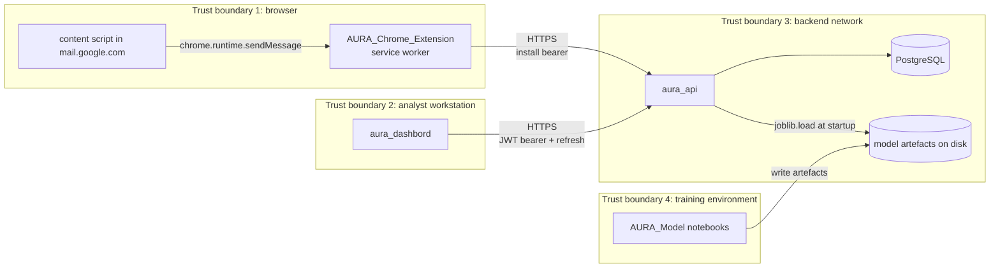
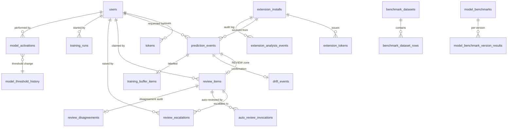
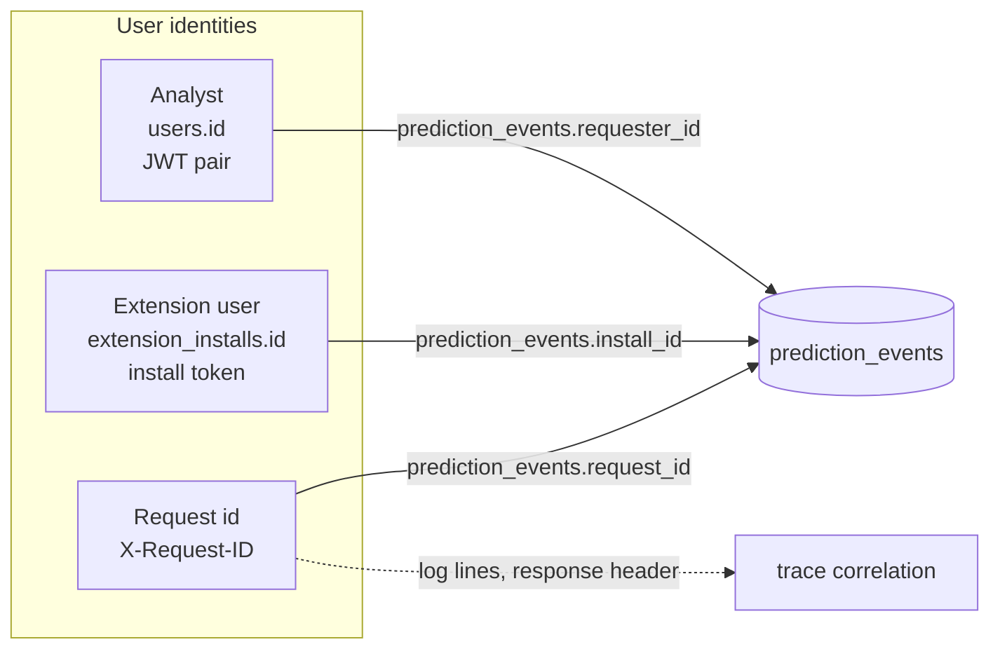

# AURA Architecture

A deeper dive into the technical contracts that span the AURA repos. The [system README](./README.md) explains *what* the platform is; this document explains *how* the four repos talk to each other in enough detail that you can change a wire shape, add a model field, or trace a single prediction from extension to drift signal without guessing.

---

## Table of contents

- [System boundaries](#system-boundaries)
- [Cross-boundary data models](#cross-boundary-data-models)
- [API contract — response envelope](#api-contract--response-envelope)
- [API contract — auth](#api-contract--auth)
- [API contract — extension surface](#api-contract--extension-surface)
- [API contract — dashboard surface](#api-contract--dashboard-surface)
- [SSE event grammar](#sse-event-grammar)
- [Model artefact contract](#model-artefact-contract)
- [Database — tables that span boundaries](#database--tables-that-span-boundaries)
- [Identity and tokens](#identity-and-tokens)
- [Caching across the system](#caching-across-the-system)
- [Failure semantics](#failure-semantics)

---

## System boundaries



There are four trust boundaries:

1. **Browser.** The extension service worker is the only component allowed to call the Gmail REST API and the AURA backend. The content script in `mail.google.com` reaches the service worker exclusively via `chrome.runtime.sendMessage` and never speaks HTTP itself.
2. **Analyst workstation.** The dashboard is unprivileged web code with cookie-stored bearer tokens. It cannot make calls the API doesn't permit, and the API is the source of truth for role checks.
3. **Backend network.** The API, the database, and the model artefact directory live together. The detector is loaded into process memory once at startup and never goes back over the network.
4. **Training environment.** The training notebooks produce artefacts. They do not run at request time. The API is the only consumer of the artefacts they write.

---

## Cross-boundary data models

Three concepts cross all four repos, in this order of importance:

### 1. `prediction_event`

A row in `aura_api`'s `prediction_events` table. Every prediction made by the system — extension, dashboard, batch — produces one. Created by `PredictionService.predict()`.

| Field | Type | Notes |
|---|---|---|
| `id` | UUID | Primary key. The same id surfaces as `prediction_id` in `inference.PredictionResult`. |
| `model_version` | str | E.g. `v1_0`. Matches the registry. |
| `predicted_label` | int | 0 or 1. |
| `phishing_probability` | float | Calibrated when a calibrator is loaded; raw otherwise. |
| `legitimate_probability` | float | `1 - phishing_probability` (when calibrated). |
| `confidence_zone` | enum | `NOT_SPAM` / `REVIEW` / `SPAM`. |
| `threshold_used` | float | Decision threshold at predict time. |
| `source` | enum | `API` / `BATCH` / `EXTENSION`. |
| `requester_id` | UUID? | User id, when sourced from the dashboard. |
| `install_id` | UUID? | Extension install id, when sourced from `/emails/analyze`. |
| `request_id` | str | The `X-Request-ID` for tracing. |
| `body_sha256` | str | SHA-256 of the body for de-duplication. |
| `engineered_features` | jsonb | The 15 named features at predict time. |
| `confirmed_label` | int? | Filled by `/drift/confirm` or by analyst review. |
| `shadow_label` / `shadow_probability` / `shadow_model_version` | optional | Phase-12 shadow predictions. Always recorded, never acted on. |
| `created_at` | timestamptz | |

This row is the join key that links every cross-boundary concept: extension verdict, dashboard prediction screen, review item, drift confirmation, training-buffer entry.

### 2. `model_version`

A string of the form `v<major>_<minor>` (e.g. `v1_0`). Single source of truth lives in `AURA_Model/models/model_metadata.json`. Surfaces in:

- The extension's `chrome.storage.local.aura_current_model_version` (cache invalidation key).
- Every API response that includes a prediction (`predicted_label`, `model_version`).
- Every dashboard model-management screen (`/models`, `/models/compare`).
- Every drift record and benchmark result row.

A new version is registered by `OnlineLearner.partial_fit_batch` (which calls `ModelRegistry.register_new_version`). Promotion is admin-gated through `/api/v1/models/{version}/promote`.

### 3. `install_id`

A UUID per Chrome extension install. The extension never sees its own install id directly (only its install token). The API joins `extension_installs.id` against:

- `prediction_events.install_id` for per-install activity.
- `extension_tokens.install_id` for active token count.
- `extension_analysis_events` (an audit log) for the admin install activity feed.

---

## API contract — response envelope

Every endpoint, including `/health`, returns the same envelope. `success` is the single source of truth.

```json
// success
{ "success": true, "value": { ... } }

// success with no body (e.g. POST /logout)
{ "success": true, "value": null }

// failure
{
  "success": false,
  "error": {
    "title":  "Validation Failed",
    "code":   "VALIDATION_ERROR",
    "status": 400,
    "fieldErrors": { "email": ["must be a valid email"] }
  }
}

// paginated success
{
  "success": true,
  "value": [ { ... }, { ... } ],
  "page": 1,
  "totalCount": 247,
  "pageSize": 25
}
```

Rules that bind every response:

- `value` and `error` are mutually exclusive. The validator on `ApiResponse` enforces this.
- Field errors are camelCase keys mapping to a list of strings.
- `details` is internal-only and never serialised.
- A 2xx body without `success` is a contract break. Clients must fail loudly, not infer success from the absence of `error`.

### Frozen error codes

Defined in `aura_api/src/shared/responses` and mirrored in `aura_dashbord/src/lib/api-core/constants.ts::ERROR_CODES`. Adding new codes is fine; removing or renaming requires a multi-PR deprecation.

```
VALIDATION_ERROR · BAD_REQUEST · AUTH_FAILED · UNAUTHENTICATED · FORBIDDEN
INSUFFICIENT_ROLE · NOT_WHITELISTED · NOT_FOUND · METHOD_NOT_ALLOWED · CONFLICT
RATE_LIMITED · BATCH_TOO_LARGE · DRIFT_BUCKET_INVALID · DRIFT_TIMEZONE_INVALID
MODEL_BUCKET_INVALID · MODEL_TIMEZONE_INVALID · MODEL_UPLOAD_TOO_LARGE
MODEL_ROLLBACK_VERSION_MISMATCH · INTERNAL_ERROR · SERVICE_UNAVAILABLE · APP_ERROR
```

---

## API contract — auth

### Dashboard JWT pair

Issued by `/auth/login`, `/auth/register`, `/auth/refresh`. Each token is a JWT signed with `JWT_SECRET_KEY` (HS256 by default). The API persists each token's SHA-256 hex hash in the `tokens` table; verification decodes the JWT *and* checks the row is not revoked or expired.

| Token | Default lifetime | Cookie name on dashboard |
|---|---|---|
| `accessToken` | 30 minutes (configurable via `ACCESS_TOKEN_EXPIRE_MINUTES`) | `access_token` |
| `refreshToken` | 7 days (configurable via `REFRESH_TOKEN_EXPIRE_DAYS`) | `refresh_token` |

`login` and `refresh_token` revoke all of the user's prior tokens before issuing the new pair (refresh-token rotation). `logout` revokes all of the caller's tokens.

### Extension install token

Issued by `/auth/extension/register` after the API verifies the supplied `X-Google-Access-Token` against Google's tokeninfo endpoint, applies allow/block lists, and decides whether the email is permitted.

- **Wire shape:** opaque random string. Stored in `chrome.storage.local.aura_install_token` as `{ token, expiresAt, registeredAt, user: {email, sub} }`.
- **At rest:** SHA-256 hex hash in `extension_tokens.token_hash`.
- **Lifetime:** 30 days by default (`EXTENSION_TOKEN_EXPIRE_DAYS`). Renewed silently in the last 5 days via `/auth/extension/renew`.
- **Rate limiting:** `/emails/analyze` is rate-limited per install, keyed on `SHA-256(token)` so the limit follows the install rather than the IP.
- **Revocation:** `extension_tokens.is_revoked = true` (admin via `/extension/installs/{id}/revoke-tokens`, or self via `/auth/extension/logout`).

The two auth surfaces are independent. A user may hold a dashboard JWT pair for a different identity than their extension install — no implicit linkage between the two.

---

## API contract — extension surface

| Endpoint | Body | Headers | Notes |
|---|---|---|---|
| `POST /api/v1/auth/extension/register` | `{ email, sub, environment: { userAgent, browser, os, language, timezone, extensionVersion } }` | `X-Google-Access-Token: <Google token>` (replaces Authorization on this one call) | Verifies tokeninfo audience (when `EXTENSION_GOOGLE_OAUTH_CLIENT_ID` is set), applies allowlist/blocklist, stores environment verbatim, issues install token. |
| `POST /api/v1/auth/extension/renew` | empty | `Authorization: Bearer <installToken>` | Returns `{ token, expiresAt }`. Rotates the install token. |
| `POST /api/v1/auth/extension/logout` | empty | `Authorization: Bearer <installToken>` | Revokes the install record. |
| `POST /api/v1/emails/analyze` | Gmail-derived DTO (see below) | `Authorization: Bearer <installToken>` | Returns `{ email: { id }, prediction: { … } }`. |
| `GET /api/v1/health` | — | none | Returns `{ status, name, version, model_version }` inside the standard envelope. |

### `ExtensionAnalyzeRequest` shape

Defined in `aura_api/src/app/dtos/extension.py`. Frozen by `BACKEND_CONTRACT.md` inside the API repo.

```jsonc
{
  "messageId": "string (1-128 chars, required)",
  "threadId":  "string?",
  "labelIds":  ["INBOX", "..."],
  "snippet":   "string?",
  "headers": {
    "from": "string?", "to": "string?", "cc": "string?", "bcc": "string?",
    "replyTo": "string?", "returnPath": "string?",
    "subject": "string?", "date": "string?",
    "messageIdHeader": "string?", "dkimSignature": "string?",
    "listUnsubscribe": "string?", "xOriginatingIp": "string?",
    "received": ["string"],
    "authResults": { "dkim": "string?", "spf": "string?", "dmarc": "string?" }
  },
  "body": { "text": "string", "html": "string" },
  "urls": ["string"],
  "attachments": [ { "name": "string?", "mimeType": "string?", "size": "int?" } ]
}
```

Request DTOs use `extra="ignore"` so the extension can add forensic fields without breaking the server. The body's combined `text + html` is hard-capped at `AURA_EMAIL_MAX_BODY_BYTES` (default 100 KiB); exceeding it returns 400 with `BAD_REQUEST`.

### `ExtensionAnalysisResponse` shape

```jsonc
{
  "email": { "id": "<gmail-message-id>" },
  "prediction": {
    "predicted_label": "SPAM | NOT_SPAM | REVIEW",   // snake_case BY CONTRACT
    "confidence_score": 0.92,                         // snake_case BY CONTRACT
    "phishing_probability": 0.92,
    "legitimate_probability": 0.08,
    "threshold_used": 0.85,
    "should_alert": true,
    "message": "string?",
    "email_id": "<gmail-message-id>",
    "model_version": "v1_0"                           // snake_case BY CONTRACT
  }
}
```

The four pinned snake_case fields (`predicted_label`, `confidence_score`, `email_id`, `model_version`) are explicitly declared without `Field(alias=...)` so `model_dump(by_alias=True)` emits them as-is. This is documented in `dtos/extension.py` and load-bearing — the extension's `AnalysisResponse` parser depends on it.

---

## API contract — dashboard surface

The dashboard surface is broader. Every route is documented in `aura_api/README.md` and mirrored in `aura_dashbord/src/lib/api-core/constants.ts::API_ROUTES`. The two files are the cross-repo wire manifest — keep them in lockstep.

Casing rule: **camelCase JSON, snake_case Python**. DTOs use `Field(alias="…")` and `model_config = ConfigDict(populate_by_name=True, from_attributes=True)`. Static factories like `PredictionResponse.from_event(event, result)` are the canonical way to build a response DTO from an SQLAlchemy entity.

### Pagination

Every list endpoint accepts:

```
?page=1&pageSize=25
```

…and returns a `PaginatedResponse`:

```jsonc
{ "success": true, "value": [...], "page": 1, "totalCount": 247, "pageSize": 25 }
```

`page` is 1-based. `pageSize` is capped at the per-endpoint limit declared in `src/shared/database/pagination.py`.

### Filtering

Filters are query params with explicit names — no JSON in the URL. Examples:

- `/predictions?label=PHISHING&zone=REVIEW&modelVersion=v1_0&source=EXTENSION`
- `/review/queue?status=PENDING&assignee=<user-id>&overdue=true`

Time ranges use ISO-8601 strings with explicit timezone (`?from=2026-04-01T00:00:00Z&to=2026-04-30T23:59:59Z`).

---

## SSE event grammar

Two endpoints stream Server-Sent Events:

- `GET /api/v1/training/runs/{run_id}/events`
- `GET /api/v1/benchmarks/{run_id}/events`

The broker is implemented in `aura_api/src/core/sse.py`. Subscribers honour `Last-Event-ID` against a per-topic ring buffer (size: `SSE_REPLAY_WINDOW_SIZE`, default 128).

### Wire format

Standard SSE:

```
event: progress
id: 17
data: {"step": "fitting", "iteration": 3, "metrics": {"f1": 0.984}}

event: done
id: 18
data: {"new_version": "v1_1", "promoted": false}
```

`Authorization` cannot be set on `EventSource`, so the dashboard uses a fetch-based reader (`src/lib/api-core/sse-client.ts`). It opens a streaming `fetch` with `Accept: text/event-stream`, decodes UTF-8, splits on `\r?\n\r?\n`, and parses each chunk's `data:` lines.

### Training-run events

| `event` field | `data` shape |
|---|---|
| `status_update` | `{ status: "PENDING" | "RUNNING" | "FAILED" | "DONE", message: string? }` |
| `metric_update` | `{ iteration, accuracy, precision, recall, f1, oovRateSubject, oovRateBody }` |
| `done` | `{ newVersion, sourceVersion, promoted: boolean }` |
| `error` | `{ message, code }` |

### Benchmark events

| `event` field | `data` shape |
|---|---|
| `progress` | `{ versionsCompleted, versionsTotal }` |
| `version_result` | `{ version, accuracy, precision, recall, f1, ece, ... }` |
| `done` | `{ runId }` |
| `error` | `{ message, code }` |

Heartbeat events (`event: heartbeat`) are sent every `SSE_HEARTBEAT_SECONDS` (default 15). Slow subscribers whose queues fill (`SSE_SUBSCRIBER_QUEUE_MAX`, default 256) drop their oldest events to keep the broker non-blocking.

---

## Model artefact contract

The on-disk shape `AURA_Model` writes and `aura_api` reads:

```
<AURA_MODELS_DIR>/
├── pipeline_components/
│   ├── subject_vectorizer.pkl       # TfidfVectorizer, output dim 2000
│   ├── body_vectorizer.pkl          # TfidfVectorizer, output dim 5000
│   └── calibrator.pkl               # optional — beta / isotonic / Platt / histogram
├── v<major>_<minor>/
│   └── production/
│       ├── phishing_detector_mlp_classifier.pkl
│       └── model_metadata.json
└── model_metadata.json              # registry-level
```

### Registry-level metadata

```jsonc
{
  "active_version": "v1_0",
  "versions": {
    "v1_0": {
      "registered_at": "2026-04-18T07:00:00Z",
      "source_version": null,
      "sha256": "<hex>",
      "metrics": { "accuracy": 0.9884, "f1": 0.9898, "rocAuc": 0.9988 },
      "promoted": true
    },
    "v1_1": { ... }
  }
}
```

`set_active(version, verify_integrity=True)` re-verifies the SHA-256 before flipping. `register_new_version` increments the minor number (`v1_0 → v1_1`).

### Feature contract

Defined in `inference/schema.py`. Identical constants vendored into `aura_api/src/shared/inference/schema.py`.

| Constant | Value | Notes |
|---|---|---|
| `SUBJECT_TFIDF_DIM` | 2000 | Output dim of `subject_vectorizer` |
| `BODY_TFIDF_DIM` | 5000 | Output dim of `body_vectorizer` |
| `ENGINEERED_DIM` | 15 | Number of named engineered features |
| `TOTAL_FEATURES` | 7015 | `2000 + 5000 + 15`. Layout `[subject_tfidf | body_tfidf | engineered]` |

`ENGINEERED_FEATURE_ORDER` is the named ordering of the 15 engineered features (`body_word_count`, `body_exclamation_count`, `email_local_length`, `name_email_consistency`, `body_url_density`, `body_url_count`, `body_entropy`, `email_digit_ratio`, `domain_entropy`, `domain_length`, `subject_entropy`, `body_avg_word_length`, `sender_name_exists`, `subject_exclamation_count`, `domain_vowel_consonant_ratio`). The order is frozen — changing it requires retraining and a coordinated cross-repo deploy.

### Calibrator interface

`PhishingDetector._apply_calibrator` accepts:

- `transform([prob])` → `[prob]` (netcal `HistogramBinning`)
- `predict([prob])` → `[prob]` (scikit-learn `IsotonicRegression`, betacal `BetaCalibration`)

Classifier-style calibrators (`predict_proba` over the feature matrix) are rejected at predict time.

### Upload sandbox

When the API receives a `.pkl` upload:

1. If `inference.upload.require_signature` is true, verify the request's `X-Upload-Signature` header equals `HMAC-SHA256(upload.hmac_secret, sha256(body))`.
2. If `inference.upload.pickle_sandbox_enabled` is true, unpickle the artefact in a short-lived subprocess with an import-graph smoke check. Reject anything pulling in non-allowlisted modules.
3. On success, register the version against the registry and persist the SHA-256 alongside `registered_at` and `source_version`.

---

## Database — tables that span boundaries

A subset — every table that is referenced by more than one external surface, or whose row produces an event a client cares about. Defined under `aura_api/src/app/models/`; migrations under `aura_api/alembic/versions/`.



Tables and the surfaces that read or write them:

| Table | Producer | Consumers (read) |
|---|---|---|
| `users` | `/auth/register`, `/users/*` (admin) | dashboard auth + nav, last-admin guard |
| `tokens` | `/auth/login` / `/refresh` | dashboard refresh interceptor (indirectly) |
| `extension_installs` | `/auth/extension/register` | dashboard `/admin/extensions`, audit logs |
| `extension_tokens` | `/auth/extension/register` / `/renew` | rate limit key (per-install), revocation paths |
| `prediction_events` | every prediction surface | analysis screens, drift, review enqueue, training buffer, dashboards |
| `review_items` | REVIEW-zone enqueue | dashboard `/review`, escalations, training buffer |
| `review_escalations` | analyst escalate | dashboard `/admin/escalations` |
| `auto_review_invocations` | `/review/queue/*/auto-review` | dashboard review item detail |
| `review_disagreements` | analyst confirm vs model | training data labelling |
| `drift_events` | `DriftMonitor.record_*` | dashboard `/drift` |
| `training_buffer_items` | analyst confirmations + CSV import + REVIEW disagreements | dashboard `/training/buffer`, online-learning |
| `training_runs` | dashboard kicks off | dashboard `/training/runs/<id>` (SSE) |
| `model_activations` / `model_threshold_history` | `/models/*/activate` / `/promote` | dashboard `/models` history |
| `model_benchmarks` / `_version_results` | `/benchmarks` runs | dashboard `/benchmarks/run/<id>` |
| `benchmark_datasets` / `_rows` | CSV import | benchmark runs |
| `extension_analysis_events` | `/emails/analyze` | dashboard `/admin/extensions/<id>/activity` |

---

## Identity and tokens

Three identity tracks coexist; they don't share keys.



- `users.id` (UUID) is an analyst identity. JWT `sub` carries it.
- `extension_installs.id` (UUID) is per-install. Install tokens are opaque — they never carry the install id; the API resolves it via `SHA-256(token)` lookup.
- `X-Request-ID` is per-request. The API generates one if absent, attaches it to logs, the response, and every persistence row.

A single user might have a dashboard account *and* be the human behind a Chrome install, but the system does not treat them as the same identity. The dashboard's `/admin/extensions/<id>/activity` correlates them visually — by email — for human consumption only.

---

## Caching across the system

Five caches matter cross-repo:

| Cache | Owner | Keyed by | TTL | Invalidation |
|---|---|---|---|---|
| `chrome.storage.local.analysis_<id>` | Extension | Gmail message id | 30 days | Model version change (read-time check), explicit eviction on logout, `dismissed_<id>` on user dismissal |
| `chrome.storage.local.aura_current_model_version` | Extension | — | 5 minutes | Refreshed by every analyse response and `/health` probe |
| `aura_install_token` | Extension | — | 30 days (server-assigned `expiresAt`) | Renewed in last 5 days; cleared on backend 401 |
| Tanstack Query cache | Dashboard | query key per endpoint | per-query (default 0) | Explicit `queryClient.invalidateQueries` after mutations |
| Auto-review LRU | API (`auto_review_cache`) | `(sender, subject, body, model_name)` | configurable (default 10 min) | Successful verdicts only; failures never cached |

### Model-version coherence

The most subtle invariant. The extension caches verdicts forever (within 30 days), but a backend model upgrade must invalidate them. The mechanism:

1. Every cached `analysis_<id>` entry stores `model_version`.
2. `aura_current_model_version` is refreshed from `/health` (or any analyse response) with a 5-minute TTL.
3. On read, `cache.readCachedAnalysis(id, currentVersion)` returns `null` if the cached entry's `model_version` differs from the current one.
4. A fresh analysis runs and overwrites the cache.

Outcome: cold entries stay valid until they're opened, and only invalidate when both versions are known and disagree. Offline reads (when `currentVersion` is unknown) keep returning the cached value — which is the correct behaviour: an old cached verdict beats no verdict at all.

---

## Failure semantics

Every cross-boundary call has a defined failure path. Clients fail loud rather than guess.

| Failure | API response | Extension behaviour | Dashboard behaviour |
|---|---|---|---|
| Bearer token revoked / expired | 401 with `UNAUTHENTICATED` | Clears install token, sets `auth_status.authenticated=false`, popup prompts re-auth | Refresh interceptor tries `/auth/refresh`; on failure, clears cookies and redirects to `/login` |
| Email not whitelisted (extension register) | 400 with `NOT_WHITELISTED` | Popup shows error, also clears the just-acquired Gmail token | n/a |
| Model not loaded | 503 with `SERVICE_UNAVAILABLE` | Popover shows "Analysis Failed" (auto-dismissed after 10 s) | Toast on the analyse button; per-screen empty state on dashboards |
| Body too large | 400 with `BAD_REQUEST` | Same | Same |
| Rate limited | 429 with `RATE_LIMITED` | Same; retry-after honoured if present | Same |
| Validation error on form | 422-equiv with `VALIDATION_ERROR` and `fieldErrors` | n/a | Per-field inline errors via react-hook-form's resolver |
| SSE stream interrupted | stream end | n/a | `onError` fires, hook moves to error state; user must reload page (no auto-reconnect today) |
| API process restart | TCP reset | extension service worker re-initialises on next message; cache may serve stale verdicts until a new model version is observed | refresh interceptor sees connection error; user retries |
| Database unavailable | 503 from `/ready`; in-flight requests fail with `INTERNAL_ERROR` or `SERVICE_UNAVAILABLE` | popover error | toast / error boundary |

Two non-obvious rules:

- The extension never trusts an HTTP 200 alone — `success: false` in the body is still a failure. This is by contract (`ApiResponse.fromAnalysisJson` reads `body.success`, not the HTTP status).
- The dashboard treats a 4xx with no `error` block, or a 2xx with no `value`, as a 500. There are no graceful "partial failure" semantics — every endpoint either succeeds completely or doesn't.
