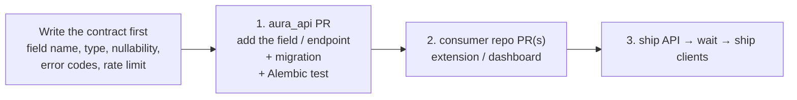

# Contributing to AURA

AURA is four repositories with one wire contract between them. Most changes live entirely inside one repo. The ones that don't — anything that adds, removes, or reshapes data flowing between two components — need a slightly more careful approach. This document is the guide for both.

If a section here disagrees with a per-repo `README.md`, the per-repo README is authoritative for that repo's local conventions; this document is authoritative for cross-repo work.

---

## Table of contents

- [Which repo owns what](#which-repo-owns-what)
- [Branch strategy](#branch-strategy)
- [Single-repo changes](#single-repo-changes)
- [Cross-repo changes](#cross-repo-changes)
- [How to test cross-repo changes locally](#how-to-test-cross-repo-changes-locally)
- [Wire-shape changes (the careful ones)](#wire-shape-changes-the-careful-ones)
- [Model artefact changes](#model-artefact-changes)
- [Code style](#code-style)
- [Commit and PR conventions](#commit-and-pr-conventions)
- [Things to never do without explicit sign-off](#things-to-never-do-without-explicit-sign-off)

---

## Which repo owns what

When you find yourself asking "where should this change live?", use this table:

| Concern | Owner repo |
|---|---|
| Database schema, migrations, SQLAlchemy models | `aura_api` |
| HTTP route, endpoint behaviour, response envelope | `aura_api` |
| Auth (JWT, install tokens, role checks) | `aura_api` |
| Background jobs, lifespan tasks, SSE broker | `aura_api` |
| Prediction model artefacts, training notebooks, dataset scripts | `AURA_Model` |
| `PhishingDetector`, `OnlineLearner`, `DriftMonitor`, `AutoReviewer` interfaces | `AURA_Model` (then vendored into `aura_api/src/shared/inference`) |
| Anything Gmail-DOM, Gmail REST, popover, mark-as-spam UX | `AURA_Chrome_Extension` |
| Manifest V3 permissions, install token storage, content-script injection | `AURA_Chrome_Extension` |
| Analyst / admin UI, sidebar, navigation, tables, forms | `aura_dashbord` |
| Tanstack Query layer, axios refresh handling, SSE consumer | `aura_dashbord` |

**Rule of thumb.** Data that crosses a process boundary is owned by the producer. The verdict popover is the extension's, the prediction row is the API's, the model artefact is the model repo's. Consumers are free to derive caches but must not be the source of truth.

---

## Branch strategy

Each repo follows the same convention:

- `main` — always deployable. Releases are cut from here.
- Short-lived feature branches: `feat/<scope>-<slug>` (e.g. `feat/review-bulk-resolve`).
- Bug fixes: `fix/<scope>-<slug>`.
- Cross-repo work: use the **same branch name in every affected repo** (e.g. `feat/extension-attachments` exists in both `aura_api` and `AURA_Chrome_Extension`). PRs reference each other by URL in the description.

Do not merge a downstream PR (e.g. the dashboard one) before its upstream API PR is merged. Use draft PRs for the downstream work until then.

---

## Single-repo changes

The 90% case. You add a feature, fix a bug, or refactor inside one repo without changing what other repos see on the wire.

1. Branch off `main` in that repo.
2. Make the change. Follow the per-repo README's conventions (e.g. the API's "controllers thin, services own logic, repositories own SQLAlchemy" rule).
3. If you touched the API, run migrations forward + back: `alembic upgrade head && alembic downgrade -1 && alembic upgrade head`.
4. If you touched the dashboard, run `npm run lint` and verify each affected screen by hand against a real API.
5. If you touched the extension, `npm run build:dev` and reload in `chrome://extensions`. Test against a real Gmail inbox — there is no headless harness here.
6. If you touched the model package, `pytest inference/tests/` — the parity test will tell you immediately if you accidentally broke training/inference parity.
7. Open a PR. The PR title is the imperative mood of the change ("Add bulk resolve to review queue"). The body explains *why*, not what (the diff already shows what).

---

## Cross-repo changes

The 10% case. You're adding a field to a wire DTO, adding a new endpoint a client needs to call, or moving behaviour across a process boundary.

The order is **producer first, consumer second**. Always.

### Concrete sequencing

1. **Decide the contract.** Write down the new wire shape — JSON keys, types, required vs optional, error codes, status codes — and link it from each repo's PR.
2. **API first, additive.** Add the field/endpoint to the API in a way that does not break existing clients. New optional fields are fine; new required fields aren't (until every client has shipped). New endpoints don't break anyone.
3. **Migrate the DB once.** A single Alembic migration covering the new tables/columns. Don't split into per-client migrations.
4. **Backfill carefully.** If you add a non-null column to a populated table, write a migration with a sensible default and a follow-up data backfill, not a single `ALTER` that locks the table.
5. **Ship the API.** Confirm `/health` is green and the new endpoint behaves on staging.
6. **Ship the consumer.** Update the dashboard / extension PRs against the now-deployed API. Run the consumer end-to-end against the real (staging) backend before merging.
7. **Tighten if needed.** Once every client emits the new field, you can make it required in a follow-up API PR.

### What "consumer" means in each direction

| Producer | Consumer (in order of impact) |
|---|---|
| `AURA_Model` → | `aura_api` (then `aura_dashbord` and `AURA_Chrome_Extension`) |
| `aura_api` → | `aura_dashbord`, `AURA_Chrome_Extension` |
| `aura_dashbord` → | (rarely a producer outside of itself) |
| `AURA_Chrome_Extension` → | (only the API; never the dashboard directly) |

---

## How to test cross-repo changes locally

You need all four repos checked out under one parent directory. The `AURA` folder this document lives in is the conventional spot for shared docs and diagrams.

### Run everything locally

Follow the [Local development guide](./README.md#local-development-guide). The order is:

1. PostgreSQL.
2. Model artefacts on disk (point `AURA_MODELS_DIR` at `AURA_Model/models/`).
3. `aura_api` — `alembic upgrade head` then `python main.py`.
4. `aura_dashbord` — `npm run dev`.
5. `AURA_Chrome_Extension` — `npm run build:dev` and load unpacked.

### Verify each touchpoint

When you change a wire shape, exercise it through every consumer that calls it. There is no automated cross-repo test harness — exercising it by hand is the test.

| Wire change | Manual test |
|---|---|
| New field on `/api/v1/emails/analyze` response | Reload extension, open an unanalysed email in Gmail. Check `chrome.storage.local.analysis_<id>` after the verdict renders — confirm the field is present. Open DevTools on `mail.google.com` and inspect the popover. |
| New field on `/api/v1/analysis/predict` response | Open `/predictions/submit` in the dashboard, run an inline prediction. Open the network tab + the Tanstack Query devtools. |
| New endpoint a screen reads | Hit the screen, confirm the network tab shows the call, confirm the rendered data matches. |
| New event on the SSE broker | Open `/training/runs/<id>` while a run is in flight. Confirm the new event lands and the UI updates. |
| Schema change | Migrate forward + back: `alembic upgrade head && alembic downgrade -1 && alembic upgrade head`. Boot the API. Hit the affected endpoints. |

### Common pitfalls

- **Stale extension cache.** The extension caches verdicts model-version-tagged for 30 days. If you change the response shape and don't bump the model version, opened emails will keep showing old cached verdicts. To force a refresh: clear `chrome.storage.local` from the extension's DevTools, or set `CACHE_TTL_DAYS=0` in `.env.development`.
- **Stale Tanstack cache.** The dashboard caches by query key. After API changes invalidate the affected keys explicitly in your hook, or hard-refresh.
- **Wrong CORS origin.** A new dashboard origin needs to be in the API's `CORS_ORIGINS`. A new extension surface needs `EXTENSION_CORS_ORIGINS`. The two lists are separate by design.
- **Missing extension allow-list.** New extension users need to be in `EXTENSION_ALLOWLIST_EMAILS` (or under an allow-listed domain) or the API rejects registration with `NOT_WHITELISTED`.

---

## Wire-shape changes (the careful ones)

The wire surface is documented in [`ARCHITECTURE.md`](./ARCHITECTURE.md). Anything here is binding:

### Casing rules

- Dashboard surface (`/api/v1/analysis/*`, `/auth/*`, `/users/*`, etc.) is **camelCase** in JSON, snake_case in Python. Pydantic DTOs declare `Field(alias="…")` for every field; serialise with `model_dump(by_alias=True, exclude_none=True)`.
- Extension surface (`/auth/extension/*`, `/emails/analyze`) is **mostly camelCase**, with two pinned snake_case fields by contract: `predicted_label` and `model_version`. These live in `dtos/extension.py::ExtensionPrediction` and must not be aliased.

### Adding a field

- Optional and additive on the response — fine.
- Required on the request — only after every client has shipped support. Use Pydantic's `extra="ignore"` on extension request DTOs so unknown fields don't break older extensions.

### Removing a field

- Add a deprecation note in the response DTO (a comment, not a wire signal).
- Wait until every consumer has stopped reading it (grep + manual confirm).
- Then remove it in a separate PR.

### Renaming a field

- Don't. Add the new name, deprecate the old, remove the old in a follow-up. Renames are two changes pretending to be one.

### Status codes and error envelopes

`ApiResponse` / `ErrorDetail` shapes are frozen. New error codes go in `aura_api/src/shared/responses` *and* in `aura_dashbord/src/lib/api-core/constants.ts::ERROR_CODES`. Unknown codes are treated as generic failures by clients — adding a code without updating the dashboard is fine; relying on a code the dashboard hasn't shipped is not.

### Adding an endpoint

1. New controller file under `aura_api/src/app/controllers/<thing>_controller.py`.
2. Service + repository + DTO files under the corresponding folders.
3. Wire the router in `src/core/factory.py`.
4. Add the route to `aura_dashbord/src/lib/api-core/constants.ts::API_ROUTES` (even if no UI consumes it yet — it's the manifest).
5. If a new feature, add the corresponding `src/features/<feature>/` folder structure on the dashboard.

### Adding a database table

1. Migration in `aura_api/alembic/versions/` — name it `NNNN_descriptive_name.py` (NNNN one greater than the latest). Don't reuse numbers.
2. SQLAlchemy model in `aura_api/src/app/models/<entity>.py` with `BaseModel` as the parent (gives you `id` UUID + `created_at`/`updated_at`).
3. Repository in `aura_api/src/app/repositories/`.
4. Run forward + back to confirm the migration is reversible.

---

## Model artefact changes

Changes inside `AURA_Model` that affect the inference contract are the most disruptive — they cross the API boundary by changing what `joblib.load` produces.

If you change:

- **Feature dimensions** (`SUBJECT_TFIDF_DIM`, `BODY_TFIDF_DIM`, `ENGINEERED_DIM`) → all consumers must be redeployed simultaneously. Coordinate.
- **Engineered feature order** → same.
- **Vectoriser / model class** → same.
- **Calibrator type** → check `_apply_calibrator` in `inference/detector.py` accepts the new shape.

Otherwise, additive changes (a new helper, a new method on `OnlineLearner`) are safe — version-bump and let consumers opt in.

The parity test (`inference/tests/test_parity.py`) is the canary. If you change preprocessing, regenerate the fixture (`python inference/tests/fixtures/_generate_fixture.py`) and explain why in the PR.

---

## Code style

Each repo has its own conventions; honour the ones already there. The cross-cutting rules:

- **Comment only the why.** Names already say what; comments are reserved for hidden constraints, surprising invariants, or workarounds for specific bugs. Don't write Javadoc / docstrings unless the code is part of an exported API.
- **No defensive validation past system boundaries.** Trust internal callers. Pydantic / `validate_email_inputs` / Zod-equivalent at the request boundary, then nothing.
- **No fallbacks for things that can't happen.** If a dependency throws, let it.
- **No new abstractions ahead of demand.** Three call sites with the same shape is when you extract a helper. Two is a coincidence.

---

## Commit and PR conventions

- Imperative mood: "Add bulk resolve" not "Added bulk resolve" or "Adds bulk resolve".
- One logical change per PR. Refactors that touch the same files as a fix should be a separate PR.
- PR description: *why* the change exists, what tradeoff was made, and a manual test plan. Don't paraphrase the diff.
- For cross-repo PRs, link the sibling PRs in the description.

---

## Things to never do without explicit sign-off

- **Force-push to `main`** in any repo.
- **Skip a pre-commit hook** (`--no-verify`). If it fails, fix the underlying issue.
- **Drop a database column** in a migration without a separate backfill PR shipped first.
- **Rotate the JWT signing key** in any environment without a coordinated logout sweep.
- **Change `EXTENSION_KEY`** — it changes the extension id, which invalidates the OAuth client allow-list and breaks every existing install.
- **Promote a new model version** that does not have measured before/after F1 on a holdout set.
- **Add `*` to `CORS_ORIGINS` while `CORS_ALLOW_CREDENTIALS=true`** — the API's startup will refuse it, but don't try.
- **Commit `.env.production`** in any repo. It's gitignored everywhere; keep it that way.
- **Edit `manifest.json` or `config.js` in `AURA_Chrome_Extension` by hand** — both are generated by `build.js`.
