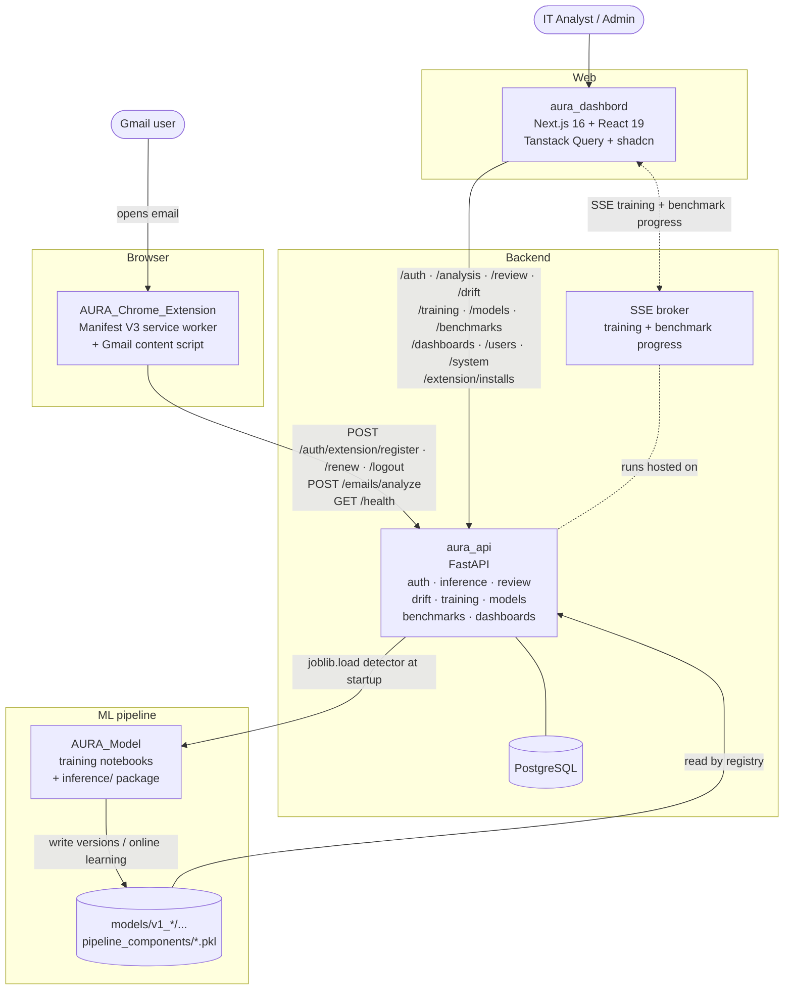
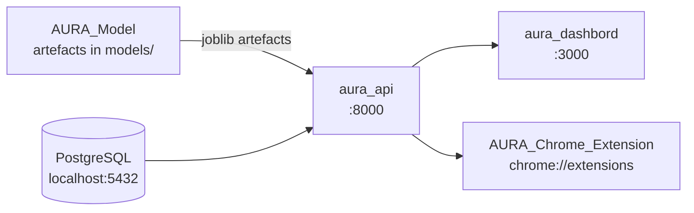
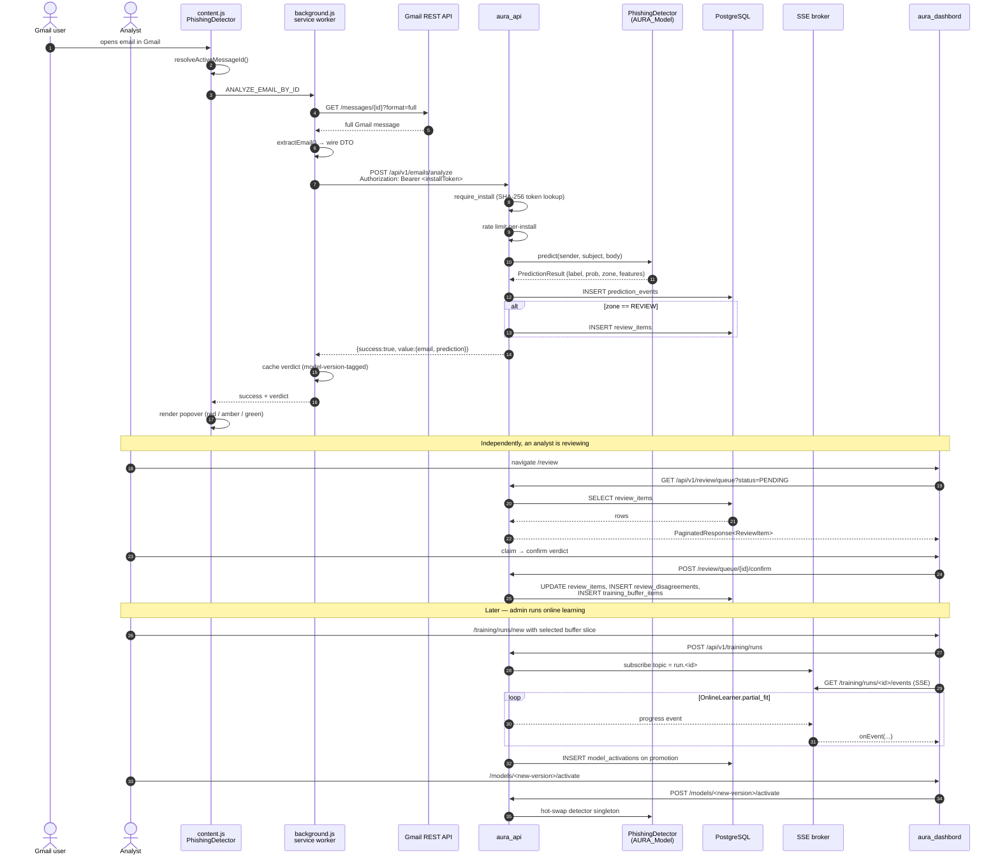

# AURA — Adaptive User Risk Analyzer

AURA is an end-to-end phishing-detection platform built around a single, deliberate idea: **a model is a teammate, not a deployment artefact**. Predictions go out the door, but they also come back in — confirmed by analysts, second-guessed by an LLM auto-reviewer, watched for drift, and turned into the next model version through online learning. Everything in this repository graph exists to make that loop fast and observable.

This is the system overview. Each component lives in its own repository; this folder is the shared memory between them — the place to put diagrams, contracts, contributing guidelines, and anything that is genuinely cross-repo.

---

## Why AURA exists

Off-the-shelf phishing detection is one-shot: a model trained once on a static corpus, deployed, and slowly degraded by the real world. AURA is built for the opposite assumption — that adversaries adapt continuously and the detection surface must adapt with them.

Three concrete problems shaped the design:

1. **Mailbox protection that runs where users actually open mail.** Most organisational email security is gateway-side and post-hoc. By the time an attacker has slipped past the gateway, the user is already looking at the message. AURA's Chrome extension renders a verdict popover *inside* Gmail, on demand, before the user clicks anything.
2. **Confidence ranges, not binary verdicts.** A 51%-vs-49% phishing call is not the same problem as a 99%-vs-1% one. AURA splits predictions into three confidence zones — `NOT_SPAM`, `REVIEW`, `SPAM` — with the `REVIEW` zone sent to either a human analyst or an LLM-backed auto-reviewer. Acting only on the high-confidence band keeps false positives from training the user to ignore alerts.
3. **A learning loop that closes.** Every prediction has a UUID. Every analyst verdict and every drift confirmation links back to that UUID. Disagreements feed a labelled training buffer; an admin can run online-learning (`partial_fit`) against a chosen base version, watch metrics on a holdout set, and promote the new model version — all without redeploying the API.

The system targets internal IT-security teams who want phishing detection that *gets better* as their staff use it, without exposing that complexity to the user opening their inbox.

---

## See it running

The analyst console, end to end - sign-in, the platform overview, the review queue and a
single REVIEW-zone item, the drift signal with its lifetime confusion matrix, and the
predictions feed.


Model governance - the version registry, a labelled benchmark dataset, and a completed
benchmark run scoring four model versions against each other on a shared holdout.


The Chrome extension popup on a cold start - backend health check, Gmail authentication
state, and per-install protection counts.


> Each clip is hosted by the repository that owns it - [`aura_dashboard`](https://github.com/kudzaiprichard/aura_dashboard/tree/main/docs/media)
> and [`aura-chrome-extension`](https://github.com/kudzaiprichard/aura-chrome-extension/tree/main/docs/media) -
> so a re-record updates one place. MP4 versions sit alongside each GIF.
>
> Recorded against a local stack at 1440x900. Sender names and addresses in the predictions
> feed are synthetic and account identifiers are masked; every metric, verdict and model
> version shown is real. The capture scripts live in [`docs/recording/`](docs/recording).

## System architecture



AURA is intentionally a *small* number of moving parts: one model, one backend, one dashboard, one extension. There is no message bus, no separate inference service, no notification microservice. Anything that earns its keep happens inside one of those four boxes.

---

## Components

| Repo | Role | Tech | Link |
|---|---|---|---|
| **aura_api** | Backend — auth, inference, review, drift, training, models, benchmarks, dashboards | FastAPI · SQLAlchemy 2.0 (async) · Pydantic v2 · Alembic · slowapi · PyJWT · scikit-learn · numpy · pandas · joblib · portalocker · PostgreSQL | https://github.com/kudzaiprichard/aura_api |
| **AURA_Chrome_Extension** | Browser client — Gmail integration | Manifest V3 · vanilla JS service worker · `chrome.identity` · Gmail REST · `node build.js` (no bundler) | https://github.com/kudzaiprichard/aura-chrome-extension |
| **aura_dashbord** | Web client — analyst & admin console | Next.js 16 · React 19 · TypeScript · Tanstack Query 5 · shadcn / Radix · Tailwind v4 · axios · sonner · Zustand · `js-cookie` · Hugeicons | https://github.com/kudzaiprichard/aura_dashboard |
| **AURA_Model** | ML pipeline — training notebooks + inference package | Python · scikit-learn (MLPClassifier) · TF-IDF · betacal · netcal · httpx · joblib · portalocker · Jupyter | https://github.com/kudzaiprichard/aura-model |

---

## End-to-end flow narrative

What happens when a user opens an email — start to finish, every repo touched.

1. **Email opened in Gmail.** [`AURA_Chrome_Extension`](https://github.com/kudzaiprichard/aura-chrome-extension)'s content script (`content.js::PhishingDetector`) detects the active `[data-legacy-message-id]` via a `MutationObserver` on `[role="main"]`. If a verdict for that id is in `chrome.storage.local` (model-version-tagged, ≤ 30 days old), it renders the cached popover and stops.
2. **Cache miss → service worker.** The content script sends `ANALYZE_EMAIL_BY_ID` to `background.js`, which lazy-initialises (`ensureReady()`), refreshes the install token if it's inside the 5-day renewal window, fetches the full message via `gmail.googleapis.com/gmail/v1/users/me/messages/{id}?format=full`, and runs `extractEmail()` to produce the wire DTO (no attachment bytes).
3. **Backend analysis.** The DTO is `POST /api/v1/emails/analyze` to [`aura_api`](https://github.com/kudzaiprichard/aura_api) with the install bearer token. The router (`extension_email_controller`) rate-limits per-install (SHA-256 keyed), resolves the install via `require_install`, and hands off to `ExtensionEmailService.analyze`.
4. **Inference.** The service pulls the `PhishingDetector` singleton off `app.state` (loaded at startup from [`AURA_Model`](https://github.com/kudzaiprichard/aura-model)'s `inference/` package), runs `detector.predict(sender, subject, body)`, applies the configured decision and alert thresholds, and gets back a `PredictionResult` (label, calibrated probability, confidence zone, engineered features, prediction UUID).
5. **Persistence.** The service inserts a `prediction_events` row with the prediction, the model version, the threshold used, the source (`EXTENSION`), the install id, and a SHA-256 of the body for de-duplication. If the result lands in the REVIEW zone, a `review_items` row is enqueued; if a `DriftMonitor` is attached, a JSONL line is appended to the drift log.
6. **Response.** The API returns the snake-case prediction block (`predicted_label`, `confidence_score`, `phishing_probability`, `legitimate_probability`, `threshold_used`, `should_alert`, `email_id`, `model_version`) inside the standard `{success, value}` envelope.
7. **Popover.** `background.js` writes the verdict to `chrome.storage.local`, increments stats, and replies to the content script. The content script renders one of four popovers — `aura-phishing` (red, includes a 5-second-countdown Mark-as-Spam button), `aura-caution` (amber, REVIEW zone, no action button), `aura-legitimate` (green), or `aura-error` (grey).
8. **Analyst review (REVIEW zone).** The analyst opens [`aura_dashbord`](https://github.com/kudzaiprichard/aura_dashboard)'s `/review` queue (Tanstack Query, paginated). They can claim, defer, confirm, escalate, reassign, or trigger the `auto_reviewer` LLM. A confirmed verdict that disagrees with the model writes a `review_disagreements` row and pushes the labelled record into the training buffer.
9. **Drift confirmation.** When the user reports the email back through any channel, the API's `/api/v1/drift/confirm` endpoint links the confirmation to the original prediction UUID. The `DriftMonitor` updates its in-memory confusion matrix; if the false-positive rate crosses the configured threshold, `/api/v1/drift/signal` flips to `WARNING`.
10. **Online-learning loop.** An admin opens the dashboard's `/training/buffer`, picks a slice (must clear `min_per_class` and `quality_gate.max_oov_rate`), and starts a `/training/runs` job. The API streams progress over SSE; `OnlineLearner.partial_fit_batch` writes a new version (`v1_n+1`) to the registry. The admin reviews the before/after F1 on a holdout set and promotes the new version via `/api/v1/models/{version}/promote` + `/activate`.
11. **Next request uses the new version.** The detector singleton is hot-swapped (with the previous version optionally retained as a "shadow" for `shadow.days`). Cached extension verdicts tagged with the old `model_version` are invalidated on next read by the model-version-coherence check in `utils/cache.js`.

---

## Local development guide

You need four things running locally to exercise the full system:



### Order matters

Start in this sequence:

```
1. PostgreSQL                              — empty DB ready to receive migrations
2. AURA_Model                              — produce or copy artefacts into aura_api/models/
3. aura_api                                — alembic upgrade head, then python main.py
4. aura_dashbord                           — npm run dev (talks to API at 127.0.0.1:8000)
5. AURA_Chrome_Extension                   — npm run build:dev, load unpacked
```

### Step-by-step

```bash
# 1. PostgreSQL
# Use a local instance or docker run -p 5432:5432 -e POSTGRES_PASSWORD=aura postgres:16
# The name must match the database in DATABASE_URL (aura_api/.env.example uses `aura_api`).
createdb aura_api

# 2. Model artefacts — not in git; pull the published release (stdlib only, no pip needed)
git clone https://github.com/kudzaiprichard/aura-model.git AURA_Model
cd AURA_Model && python scripts/fetch_artefacts.py && cd ..
# Downloads release v1, verifies its SHA-256, extracts into AURA_Model/models/.
export AURA_MODELS_DIR="/abs/path/to/AURA_Model/models"
# Or extract straight into the API: python scripts/fetch_artefacts.py --dest ../aura_api/models
# Skip this and the API still boots, but every prediction endpoint returns 503.

# 3. Backend
cd aura_api
python -m venv venv && source venv/bin/activate    # POSIX
# venv\Scripts\activate                            # Windows PowerShell
pip install -r requirements.txt
cp .env.example .env
# Set DATABASE_URL=postgresql+asyncpg://... JWT_SECRET_KEY=... ADMIN_PASSWORD=...
alembic upgrade head
python main.py                                     # binds 127.0.0.1:8000

# 4. Dashboard  (new terminal)
cd aura_dashbord
npm install
npm run dev                                        # binds 127.0.0.1:3000
# Open http://localhost:3000 and sign in as ADMIN_EMAIL (default: admin@aura.local)

# 5. Chrome extension  (new terminal)
cd AURA_Chrome_Extension
npm install
cp .env.development.example .env.development       # then set CLIENT_ID (your own OAuth client)
npm run build:dev                                  # writes manifest.json + config.js
# In chrome://extensions: enable Developer mode → Load unpacked → select repo root
# Open https://mail.google.com → click AURA popup → Authenticate with Gmail
```

### Cross-repo dependencies you can't skip

- The dashboard's default `NEXT_PUBLIC_API_BASE_URL` is `http://127.0.0.1:8000/api/v1`. If you change the API port, set `NEXT_PUBLIC_API_BASE_URL` in the dashboard environment.
- The extension's `BACKEND_URL` is read from `.env.development`, which is **gitignored** — copy `.env.development.example` and fill it in before the first build. `CLIENT_ID` is per-developer: create your own OAuth client in Google Cloud Console. If your API is on a non-default port, edit that file and re-run `npm run build:dev`. **Production builds enforce HTTPS** — `build.js` aborts otherwise.
- The API's `EXTENSION_ALLOWLIST_EMAILS` (or domain) gates extension registration. Set it to the Gmail address you'll authenticate with, or registration will return `NOT_WHITELISTED`.
- The API's `CORS_ORIGINS` must include `http://localhost:3000` for the dashboard to call it. The `EXTENSION_CORS_ORIGINS` default of `https://mail.google.com` covers the extension.
- The training corpus is not tracked in git either, and is **not needed to run the platform** — only to re-train. It lives at [Zenodo 8339691](https://zenodo.org/records/8339691) (origin, cite this) and is mirrored verbatim at [`kudzaiprichard/aura-phishing-email-corpus`](https://huggingface.co/datasets/kudzaiprichard/aura-phishing-email-corpus) in case Zenodo is unreachable. See `AURA_Model`'s README for retrieval and a note on a duplicated source file.
- The model artefacts are distributed as a [GitHub release](https://github.com/kudzaiprichard/aura-model/releases/tag/v1), not tracked in git. `scripts/fetch_artefacts.py` in `AURA_Model` downloads and verifies them. If you change the artefact layout, the API's `inference.models_dir` must still point at a directory matching the registry contract (`v<major>_<minor>/production/...` + `pipeline_components/*.pkl`).

---

## Runtime sequence — extension submission to dashboard visibility

This is the same flow as the narrative above, drawn as a sequence diagram with each component named. Use it as the canonical "what happens when an email is analysed" picture.



---

## Design pillars

A handful of constraints fall out of the design above and are honoured everywhere:

- **The API is the only source of truth.** Neither the dashboard nor the extension owns state that the API doesn't already have a row for. The dashboard's Tanstack Query cache and the extension's `chrome.storage.local` are derived caches; the API's PostgreSQL is canonical.
- **One envelope, everywhere.** `{success, value, error?}` shape is the same on `/health`, `/auth/login`, `/emails/analyze`, every dashboard endpoint, every extension endpoint. Clients parse it once and forget the wire shape exists.
- **Two surfaces, no shared prefix.** `/api/v1/analysis/*` is the dashboard surface; `/api/v1/emails/analyze` is the extension surface. They have separate DTOs, separate CORS allow-lists, separate rate-limit buckets. Widening one cannot accidentally widen the other.
- **Every prediction is a row.** Every prediction has a UUID, lives forever, and links to its review verdict, drift confirmation, and (eventually) the training-buffer row that taught the next version. There are no "ephemeral" predictions — even cached extension verdicts are reconstructable from `prediction_events`.
- **Model version is a wire field.** `model_version` appears in extension verdicts, dashboard predictions, drift records, and benchmark results. Caches are tagged with it; mismatches invalidate on read. The version string is the same one `AURA_Model` writes into its `model_metadata.json`.

---

## Where to go next

- For developer setup and conventions inside a single repo, read that repo's README.
- For how to make a change that crosses repos (bumping a wire shape, renaming a field, deprecating an endpoint), read [`CONTRIBUTING.md`](./CONTRIBUTING.md).
- For deeper technical contracts — the database tables that span boundaries, the wire DTOs, the SSE event grammar, the model artefact layout — read [`ARCHITECTURE.md`](./ARCHITECTURE.md).

---

## Repository links

| Repo | Role | Description |
|---|---|---|
| [aura_api](https://github.com/kudzaiprichard/aura_api) | Backend | FastAPI service: auth, inference, review, drift, training, models, benchmarks, dashboards. |
| [AURA_Chrome_Extension](https://github.com/kudzaiprichard/aura-chrome-extension) | Browser client | Manifest V3 Gmail extension. Calls `/api/v1/auth/extension/*` and `/api/v1/emails/analyze`. |
| [aura_dashbord](https://github.com/kudzaiprichard/aura_dashboard) | Web client | Next.js 16 / React 19 analyst & admin console. |
| [AURA_Model](https://github.com/kudzaiprichard/aura-model) | ML pipeline | Training notebooks + the `inference/` package the API loads at startup. |
